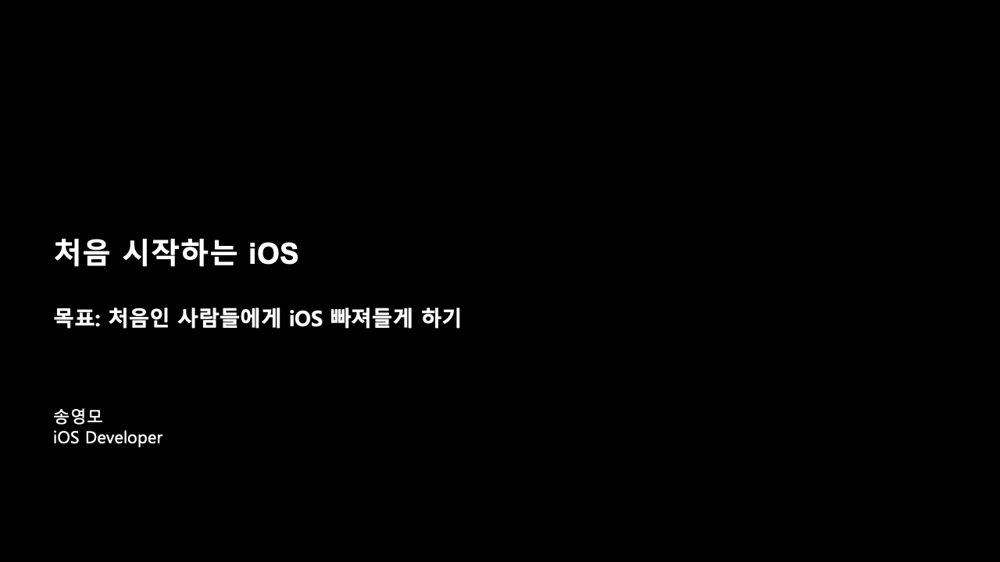

안녕하세요. 

오늘 저는 iOS 소개 발표를 맡았는데, 모두가 들으면 좋을 법한 수준으로 발표를 열심히 준비했습니다. 

발표 시작하도록하겠습니다.

 

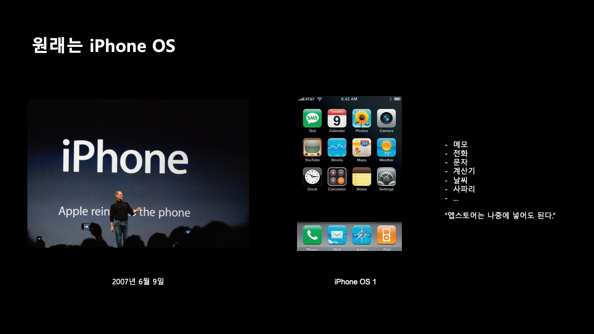

iPhone은 2007년 출시가 되었고, 

이때 iPhone에 들어가는 운영체제 이름을 iPhone OS라고 했습니다. 

지금도 많이 쓰이고 있는 앱들이 이 버전에서 출시가 되었습니다.

 

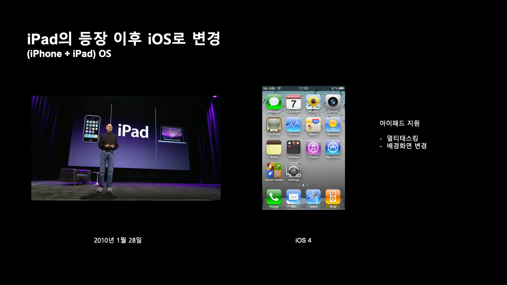

iPad가 등장하고 iPhone 운영체제와 통일시키기로 결정했습니다.

그래서 이름을 iPhone OS에서 iOS로 변경했습니다.

 

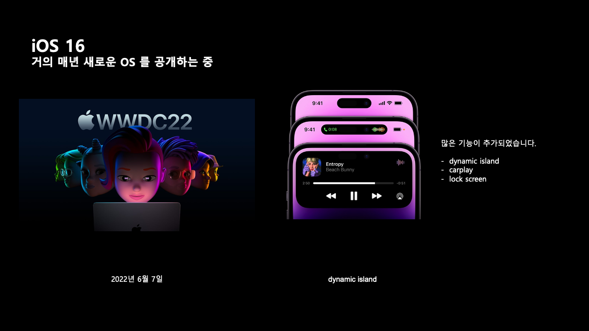

작년 WWDC에서는 iOS 16버전이 공개되었고, 

노치 디자인을 제어할 수 있는 다이나믹 아일랜드가 엄청 인기였습니다. 

애플은 매년 새로운 OS를 공개하는 중입니다.

 

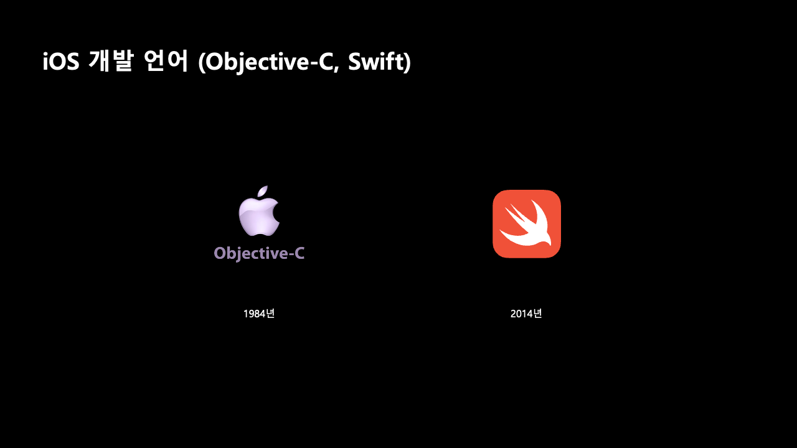

언어에 대해 소개하려고하는데 Objective-C라는 언어와 Swift입니다. 

지금은 Objective-C는 지원이 중단되었지만, 아주 오랜 시간동안 애플의 공식 언어였습니다.

 

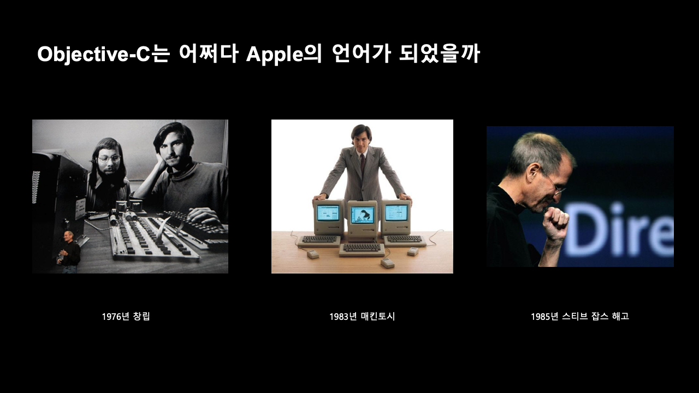

Objective-C가 어쩌다 Apple의 언어가 되었을까 하는 스토리를 소개하려고합니다.

 

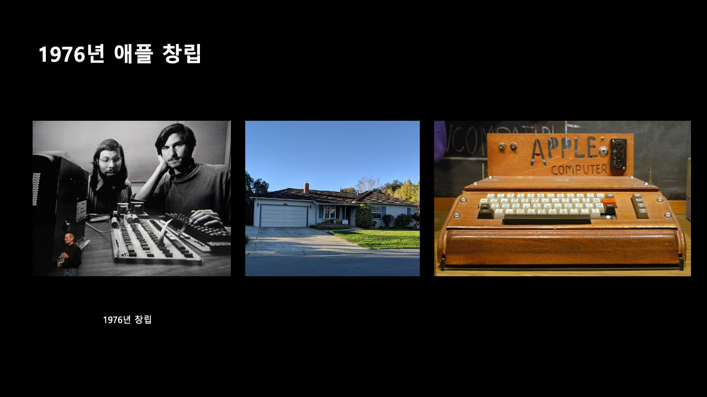

1976년 중간에 있는 차고지에서 스티브 잡스는 스티브 워즈니악이랑 애플이라는 회사를 창립했고, 

오른쪽 사진의 Apple 1이라는 컴퓨터를 출시했습니다.

 

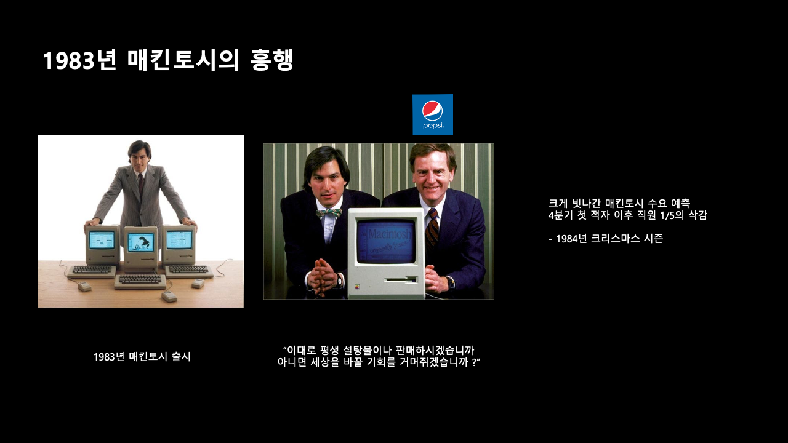

그 이후에 컴퓨터를 출시하다가 83년에 매킨토시라는 개인용 컴퓨터를 출시하고 대박이 터지고, 

스티브잡스는 당시 11년만에 자기 실력으로 펩시 CEO까지 올라온 존 스컬리라는 사람을 CEO로 영입했습니다. 

그로부터 1년 후에 매킨토시 수요예측이 실패하면서 애플은 큰 손해를 보게됩니다.

 

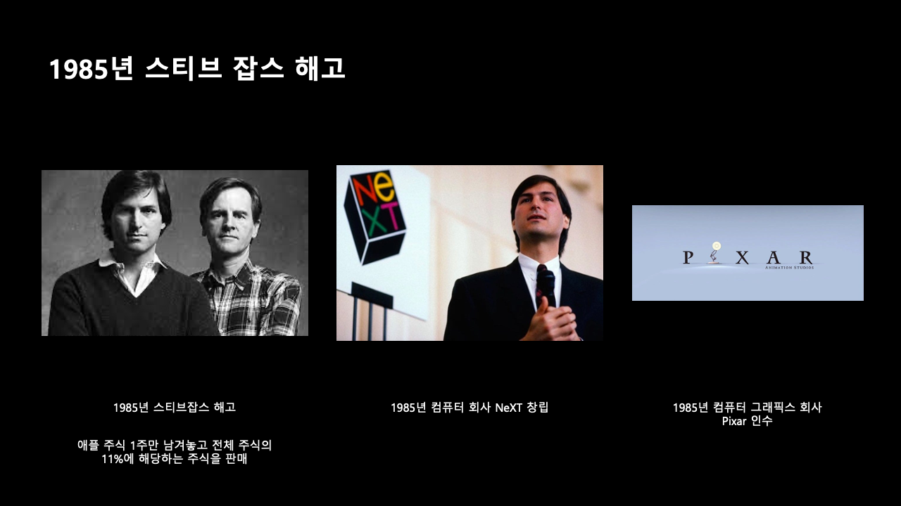

존 스컬리와 스티브잡스의 극단적인 견해차로 존 스컬리는 스티브 잡스를 해고합니다. 

해고당한 스티브잡스는 넥스트라는 컴퓨터 회사를 창립하고, 픽사라는 그래픽스 회사를 인수합니다.

 

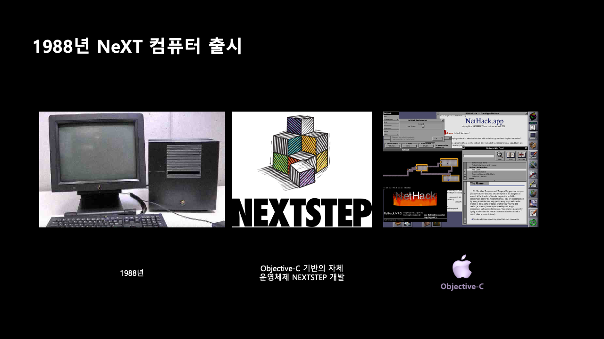

3년 후에 넥스트 회사는 넥스트 컴퓨터를 출시했는데, 

이때 자체 운영체제인 넥스트스텝을 Objective-C을 기반으로 개발했습니다.

 

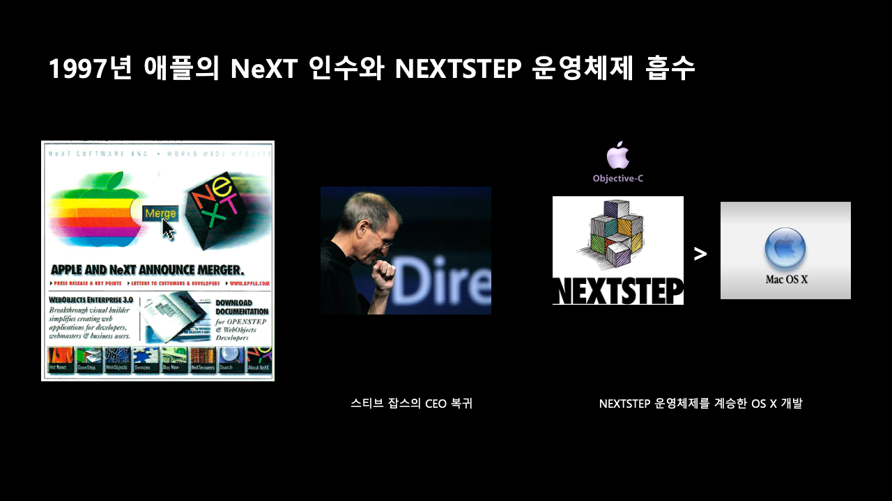

애플에게는 자체 운영체제가 필요했는데 몇번 만들다가 기술력이 부족해서 망하고, 

넥스트 회사를 인수합병하면서 운영체제의 기술력을 확보하려고했습니다. 

합병 하면서 스티브잡스는 다시 CEO자리로 복귀했고, 곧바로 넥스트스텝의 기술력으로 OS X 라는 지금의 맥북 운영체제를 개발합니다.

 

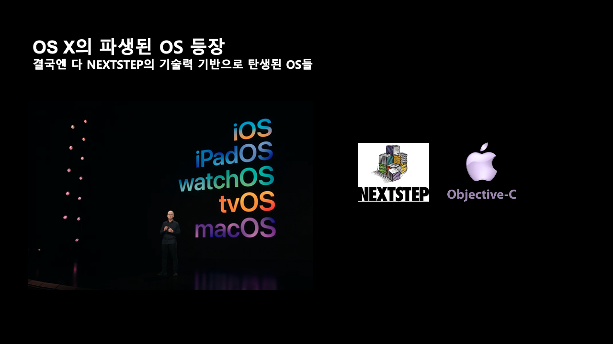

지금은 여러 OS로 분리되었는데 결국에는 Objective-C 기반의 넥스트스텝의 기술력으로 모두 파생된 운영체제 들이었습니다. 

 

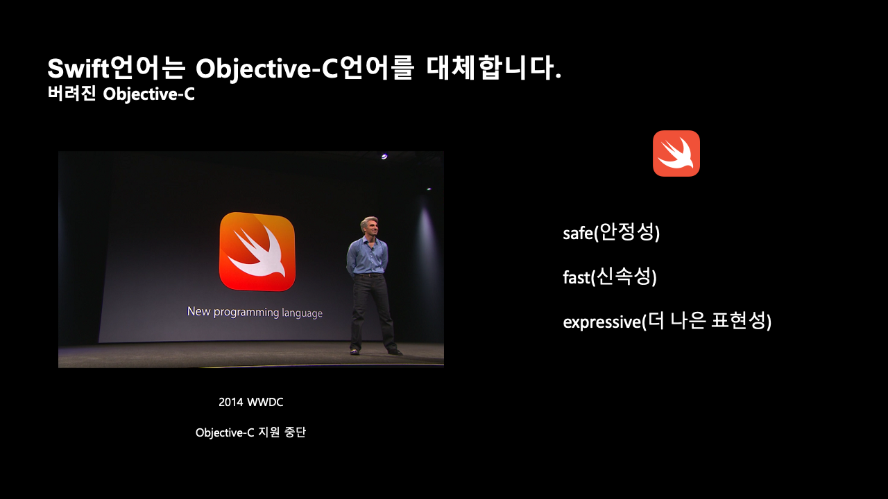

2014년 애플은 Objective-C를 버리고 Swift라는 언어를 출시했고 이렇게 현재까지 Swift언어가 유지되고 있습니다.

 

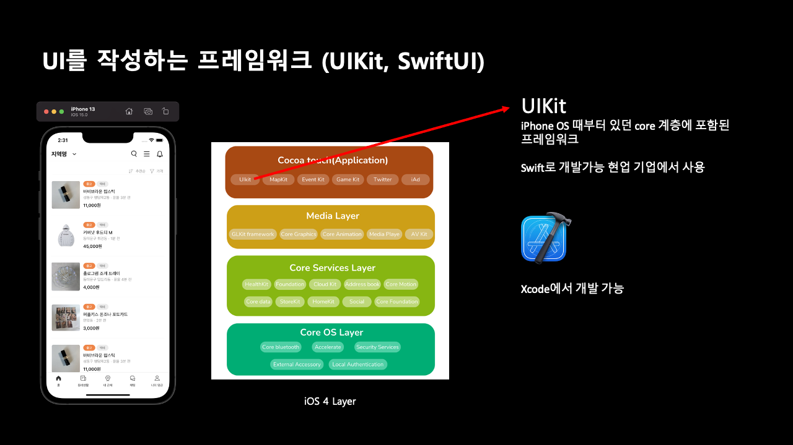

당근마켓같은 앱은 어떻게 만드는지 소개해드리면, 

iOS의 4 계층 중 코코아 터치 계층에 포함되어있는 UIKit이라는 프레임워크를 사용해서 개발하면 됩니다.

 

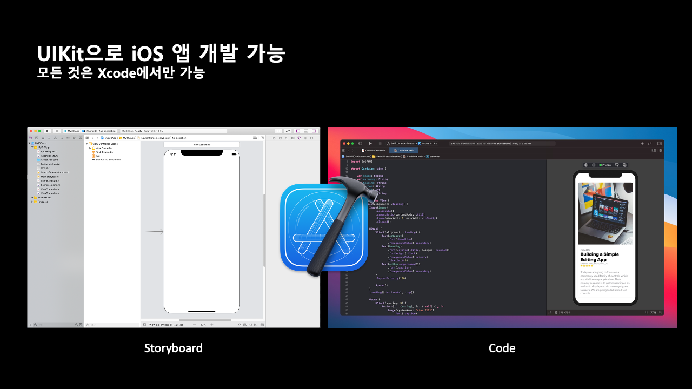

Xcode라는 맥북 전용 프로그램이 필요해서 맥북이 필수입니다.

방식은 드래그 앤 드롭으로 개발하는 스토리 보드와 코드로 개발하는 방식이 있습니다.

 

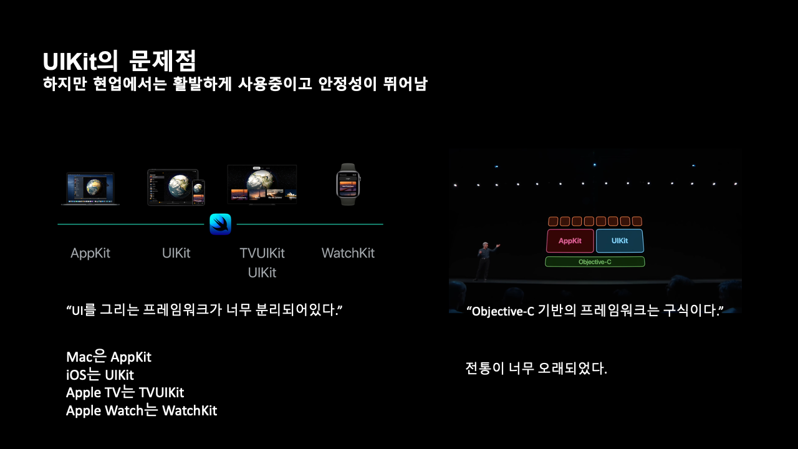

UIKit의 단점으로는 맥북, 아이폰, 아이패드, 애플 티비, 애플 워치마다 프레임워크들이 분리 되어있다는 단점이 있습니다. 

그리고 모두 구식이라는 점입니다. 

하지만 안정성이 뛰어나서 현업에서는 대부분 UIKit을 사용하고 있습니다.

 

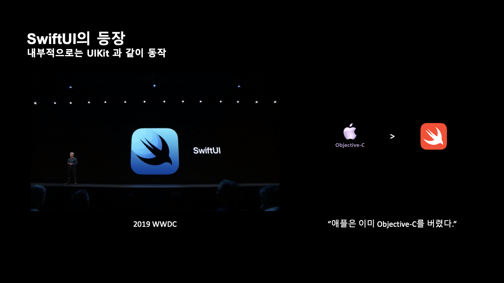

19년도에 SwiftUI가 등장하고, 이제 UI 프레임워크를 대체하는 방향으로 애플은 결정했습니다.

 

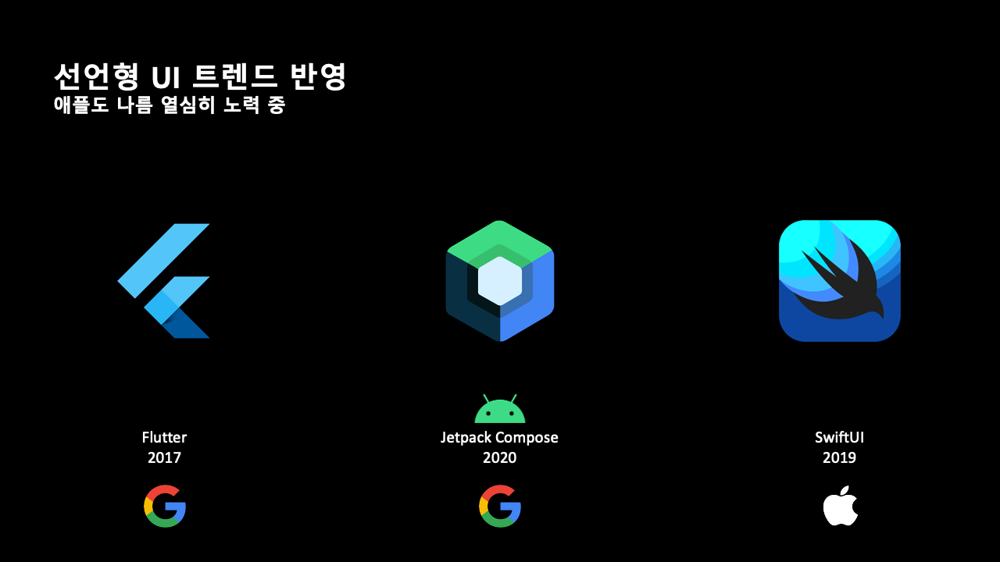

한창 유행이었던 모바일 UI 트렌드인 선언형 프레임워크들이 있었고, 

구글 보다는 1년 느렸지만 나름 최선을 다하고 있다는 점이 핵심입니다.

 

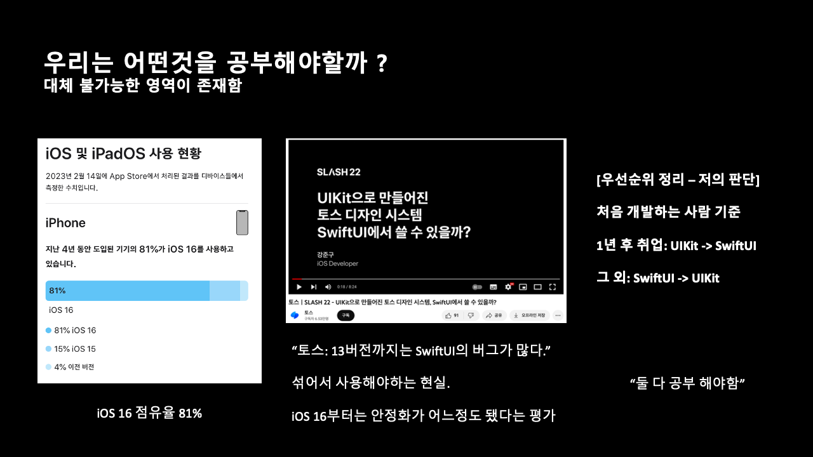

우리는 Swift언어를 공부해야하고, UIKit과 SwiftUI를 둘다 공부해야합니다. 

 

감사합니다 | _ \
