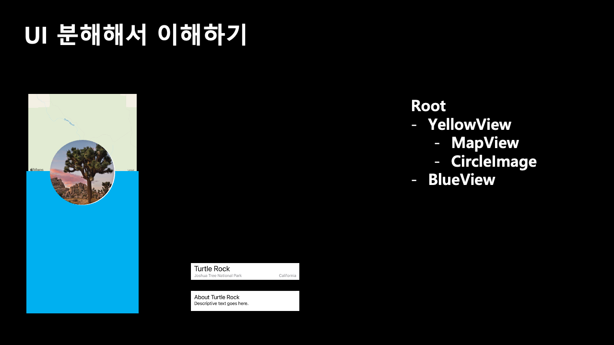

안녕하세요. 

오늘은 Auto Layout을 준비하였습니다. 

목표는 기본적인 레이아웃 작성법 이해하기 입니다.

발표 시작하겠습니다.

 

우선, 두가지의 기본 사항이 있는데 

첫번째로는 모든 View는 정사각형 형태의 Size를 갖고 너비값과 높이값을 갖습니다. 

 

두번째로는 모든 View는 Position을 갖습니다. 

즉 View가 어느 사이즈로 어디에 놓일지가 결정되어야 화면에 보여지게 됩니다.

 

CGRect라는 정사각형으로 해당 뷰의 사이즈와 위치를 정해줄 수 있습니다. 

파란색 뷰를 만들어주었는데, 아이폰 12 사이즈에 맞춰서 너비를 390으로하고 높이를 4분의 1값인 211로 했습니다.

 

아이폰 14 Pro Max에서 보면 어떻게 될까요 ? 저희는 아까 너비를 390, 높이를 211로 고정시켰기 때문에 오른쪽 처럼 보이게됩니다. 

아무래도 우리가 원한건 이게 아니라 화면에 딱 들어맞는 걸 원했는데, 어떻게 해결할 수 있을까요 ?

 

이렇게 할수있습니다. 화면 사이즈를 구해서 너비 값을 화면의 너비값으로 맞추고, 

화면 높이값을 구해서 4분에 1한 값을 정사각형에 집어넣으면 됩니다.

 

그럼 이번에는 오른쪽 사진처럼 딱 들어맞게되고 높이도 932를 4분에 1한 값이 들어가게 됩니다.

 

그런데 가로모드를 해버리면 어떻게 될까요 ?

사실 처음부터 문제가 있었어요. 우리가 원했던거는 오른쪽 사진이었는데, 왼쪽 처럼 너비값과 높이값이 
이렇게 바뀌게 됩니다. 

어떻게 해결할 수 있을까요 ? 

가로 모드를 바꿀때마다 너비값과 높이값을 업데이트 시켜주면 될 텐데, 

너무 귀찮지 않을까요 ? 

이런 문제는 계속해서 발생될거에요.

 

이때 등장하는 개념이 바로 Auto Layout 입니다.

바로 뷰 사이의 관계로 사이즈와 포지션을 선언해주는 방식입니다.

기본적으로 width와 height가 있고, 새로 등장한 개념인 Leading, Trailing, Top, Bottom이 있습니다. 

그리고 X축 중앙값인 Center X와 Y 축 중앙값이 Center Y가 있는데, 우선은 넘어가봅시다.

 

이제 아까 파란색 뷰를 다시 Auto Layout으로 잡아보겠습니다. 

파란색 뷰의 왼쪽은 노란색 뷰의 왼쪽과 연결해주고, 파란색 뷰의 오른쪽은 노란색 뷰의 오른쪽과 연결해주고, 파란색 뷰의 위쪽은 노란색 뷰의 위쪽과 연결해줍니다. 

이러면, Leading과 Trailing 즉 왼쪽과 오른쪽이 연결되었기 때문에 자연스럽게 Width값이 정해지게 됩니다. 

하지만 아직 Bottom을 연결해주지 않아서 Height값이 정해지지 않았습니다.

Bottom은 어떻게 정해주는게 좋을까요 ?

 

바텀을 정해주지말고 높이값을 정해주면, 알아서 바텀을 찾아갈거에요.

왜냐면 위쪽을 노란색 뷰와 연결해주었기 때문에 높이를 알려주면 위쪽부터 높이만큼 떨어진 부분이 Bottom이 될테니까요. 

그래서 파란색 뷰의 높이값을 노란색뷰의 높이를 4를 나눈값으로 연결해주었습니다.

 

이제 가로모드를 하면 어떻게 될까요 ?

모든 관계는 노란색뷰와 연결되어있기 때문에 이렇게 잘 보여지게 됩니다.

 

이제는 실전으로 쪼개서 이해해보겠습니다.

왼쪽과 같은 화면이 있고, 이거를 4개로 나누어보았어요.

 

먼저 노란색 뷰를 Root 바로 밑에 넣어줍니다. 

이를 Root의 자식으로 넣는다고 표현합니다.

 

그런다음 지도 뷰를 노란색 뷰의 자식으로 넣어줍니다. 

그럼 MapView의 부모는 누구일까요 ? 

바로 노란색 뷰입니다. 

 

그리고 CircleImage도 넣어주고, 파란색 뷰를 넣어줍니다. 

파란색뷰는 Root의 자식으로 넣어줄거에요.

 

그리고 이렇게 Label1과 2를 파란색 뷰의 자식으로 넣어줍니다.

 

MapView의 왼쪽 오른쪽 위 높이 값은 어떻게 하면 좋을까요 ? 

 

지금은 보이지 않지만 뒤에 있던 노란색뷰와의 관계로 표현하면 됩니다. 

 

그런데 사실 MapView의 부모는 노란색 뷰였어요. 

그래서 부모와 동일하다는 뜻에 equalToSuperView를 해준다면 

노란색 뷰가 알아서 연결될거에요. 

 

이번에는 파란색 뷰로 연습해보겠습니다. 여기서 주목해야할 지점은 Top과 Bottom 입니다. 

 

Top은 MapView의 Bottom과 연결해주고, Bottom은 Root의Bottom으로 연결해주면 높이값이 알아서 정해지게됩니다.

감사합니다. (빼먹었어요.) | _ \

 

 

 

